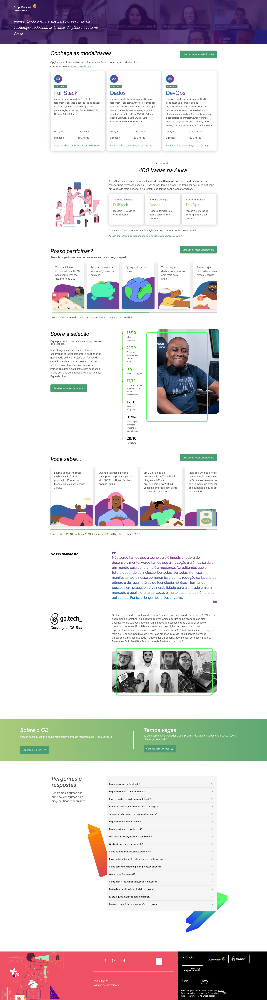

# Site Desenvolve

### Nível

Difícil

### Objetivos

1. Replicar a página inicial do programa [Desenvolve 2022](https://desenvolve.grupoboticario.com.br/)

### Requisitos

- Deve ser um site responsivo (tente começar o visual pensando em celulares primeiro);

### Adicional (não obrigatório)

- Replicar as outras páginas do programa;

### Pré-visualização

_Mobile_

_Desktop_

### Como enviar o desafio

1. Faça um fork do repositório (vídeo com tutorial no [YouTube](https://www.youtube.com/watch?v=l1rwvDvD1og));
2. Crie uma branch com o padrão `seu-usuario-git/nome-do-desafio`, exemplo: `matheusrufinos/site-desenvolve`;
3. Crie uma pasta dentro da pasta do desafio com seu usuário do GitHub e coloque seu código dentro, ex: `site-desenvolve/matheusrufinos`;
4. Faça as alterações necessárias no código e realize o commit + push na sua branch;
5. Abra uma Pull Request apontando da sua branch para branch main, descreva quais alterações foram realizadas e anexe um screenshot da solução final.
